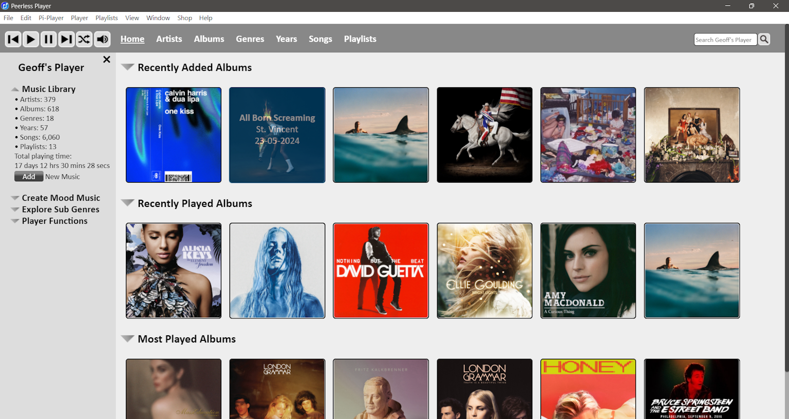
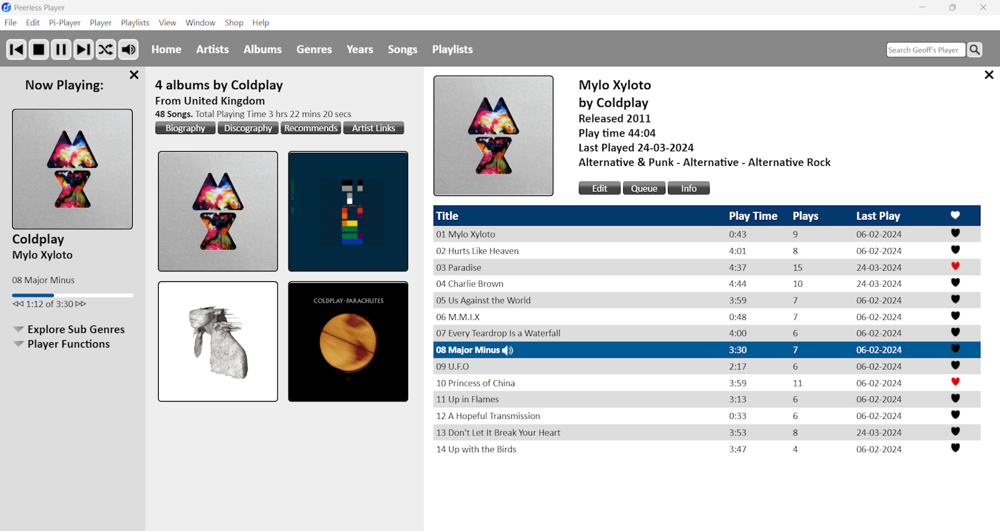
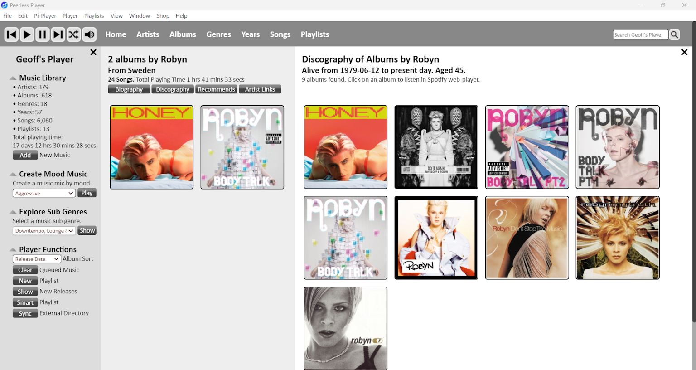

# Listen & Explore Music with Peerless Player
## About
Peerless Player is a desktop app which plays music files in mp3, m4a, flac and wav formats and is available as a free Windows download. Use this desktop app to organise and listen to your offline music collection, read bigraphies and discographies of your artists and explore new music and recoomendations.

For more information visit the website here: <a href="https://www.peerlessplayer.rocks">www.peerlessplayer.rocks</a>

### Main Features
**Listening to music**

- Organise your albums by:
  - Artist
  - Album
  - Genre
  - Sub Genre
  - Year
  - Songs

- Sort your albums by:
  - Alphabetically
  - Artist
  - Date Added
  - Date Last Played
  - Most played

- Create playlists.

- Create a playlist based on a seed track.

**Exploring music**

- View artist discographies.
- View artist biographies.
- View artist recommendations.
- Links to artist's social media.
- View latest music releases.

### Getting Started
Once downloaded, for help with using Peerless Player, on the menu bar click on <b>Help</b> and then <b>User Guide</b>. Follow the <b>Getting Started</b> section, copied below.
- On the menu bar click on <b>File</b> and then <b>Settings.</b> This will take you to the Settings page where you can customise the app.
- Under the <b>Select Music Directory</b> option, click on the <b>Browse</b> button and select the directory where your music is stored.
- When you have finished adjusting the settings, click on the <b>Save</b> button at the top of the screen.
- Please note that the app can only read music files from one directory. It is therefore recommended to keep all your downloaded music in one directory. This will aid syncing your music directory to external storage for your phone, car or yacht.
- Once you have set your music directory, you can start adding music to your database by following point 5 in the User Guide.

